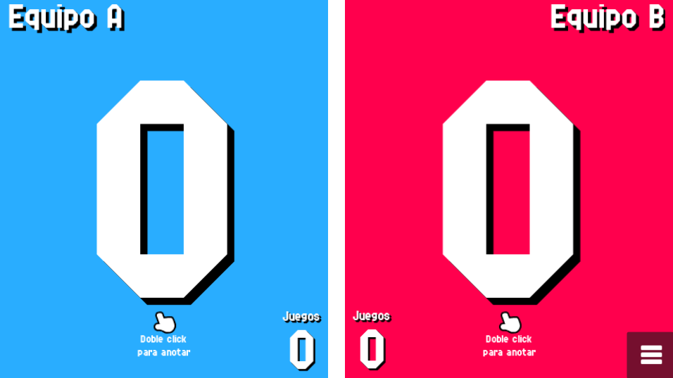
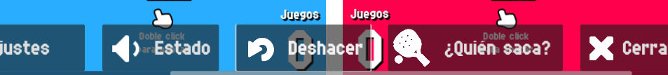

# Counter Screen

This is the main screen of Padel Counter, where the score is kept.

{: style="display:block;margin-left:auto;margin-right:auto;width:60%;padding-top:10px;padding-bottom:10px;"}

Double tapping the screen on each side will increment the score for each team.

If you have mapped a controller in the Controls section of the settings, you can also double press that input to increment the score.

In the bottom right corner there's a menu button you can press to show the following options:

{: style="display:block;margin-left:auto;margin-right:auto;width:80%;padding-top:10px;padding-bottom:10px;"}

- Close menu: Pretty self explanatory.
- Who serves?: Replays the animation that shows who serves the ball in this game.
- Undo: Undo the last scoring action.
- Status: The announcer narrates the current status of the match: sets, games, scores and service.
- Settings: Shows the settings menu. Only options editable from within a match will appear.
- Leave game: Press this button to leave the current match.
