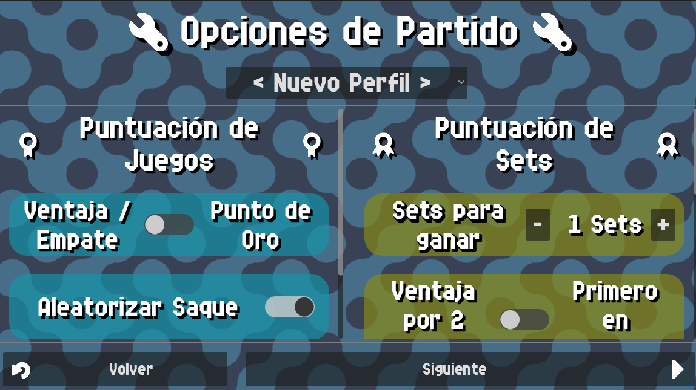

# Match Settings

In the `Match Settings` screen you will find the following settings:

{: style="display:block;margin-left:auto;margin-right:auto;width:60%;padding-top:10px;padding-bottom:10px;"}

## Game Scoring Settings

These settings affect how games in a match work.

{: style="display:block;margin-left:auto;margin-right:auto;width:45%;padding-top:10px;padding-bottom:10px;"}

### Advantage/Deuce or Golden Point

- Advantage/Deuce: Makes the game work with Advantage system. When both teams reach 40 points
  one of them must win by a difference of 2 points (advantage), otherwise both teams go to
  40-40, which is called deuce.
- Golden Point: Makes the game work with Golden point. When both teams reach 40 points, the
  first team to score wins the game.

### Advantage on last game of set

!!! info
    This setting is exclusive to [**Golden Point**](./match.md#advantagedeuce-or-golden-point)
When this setting is enabled, on the last game of a set (one of the teams is 1 game away of
winning the set), the game will be played with the Advantage/Deuce system.

### Randomize Service

When this setting is enabled, the first service of the match will be randomized between one
of the 4 players from both teams. When disabled, the first player to serve will be the Player 1
from the A team.

### Change court

When this setting is enabled, the app will track court changes and will announce them. The
colors of the teams will also swap places in the padel counter screen when a change court
happens.

## Set Scoring Settings

These settings affect how sets in a match work.

{: style="display:block;margin-left:auto;margin-right:auto;width:45%;padding-top:10px;padding-bottom:10px;"}

### Sets to win

Number of sets to win the match

### 2 Game Advantage or First to score

- 2 Game Advantage: The set will be scored when one of the teams has a 2 game advantage over the
  other team, as long as that team has at least a certain minimum of scored games. See [Minimum Games](./match.md#minimum-games) setting.
- First to score: The set will be scored when one of the teams reaches the amount of
  games defined in [Games to set](./match.md#games-to-set).

### Games to Set

!!! info
    This setting is exclusive to [**First Score**](./match.md#2-game-advantage-or-first-to-score)
The amount of games a team needs to win the set. No difference by 2 games required.

### Minimum Games

!!! info
    This setting is exclusive to [**2 game advantage**](./match.md#2-game-advantage-or-first-to-score)
The minimum amount of games a team must have in order to qualify to score a set. The team still
has to have a difference of 2 games to score the set.

### Tiebreak

!!! info
    This setting is exclusive to [**2 game advantage**](./match.md#2-game-advantage-or-first-to-score)
Enable this to activate tiebreak, which will trigger whenever both teams reach a certain amount
of games (defined in [Tiebreak At](./match.md#tiebreak-at)). Tiebreak is a special game where the goal is to reach 7 points, the fist team to reach 7 points with 2 point difference scores game and set.

### Tiebreak At

!!! info
    This setting is exclusive to [**Tiebreak**](./match.md#tiebreak)
This is the amount of games both teams need to have in order for tiebreak to activate.

### Super Tiebreak

!!! info
    This setting is exclusive to [**Tiebreak**](./match.md#tiebreak)
Enable this to activate super tiebreak. Normal tiebreak is won by reaching 7 points with a 2
point difference. On the last set of the match, with super tiebreak enabled, this last tiebreak
is won by reaching 10 points with a 2 point difference instead of 7.
