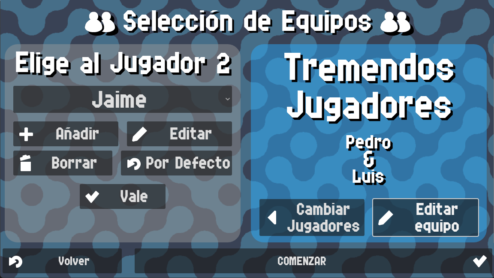

# Selección de Equipos

En esta pantalla puedes elegir a los jugadores que jugarán el partido. Después de elegir a los jugadores,
se mostrará en pantalla un nombre de equipo y un color para los jugadores, y si no escogiste ningún jugador
por defecto, serán editables.

{: style="display:block;margin-left:auto;margin-right:auto;width:60%;padding-top:10px;padding-bottom:10px;"}

Los nombres de los equipos se mostrarán en la pantalla principal del contador, junto a la puntuación.

{: style="display:block;margin-left:auto;margin-right:auto;width:60%;padding-top:10px;padding-bottom:10px;"}

Los nombres de los jugadores se usarán para mostrar quién saca en el juego actual.

{: style="display:block;margin-left:auto;margin-right:auto;width:60%;padding-top:10px;padding-bottom:10px;"}
