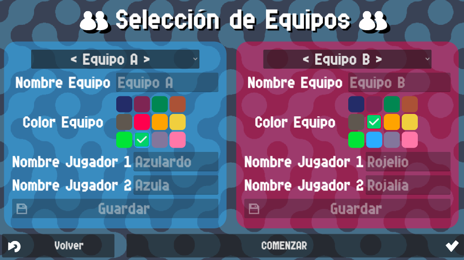
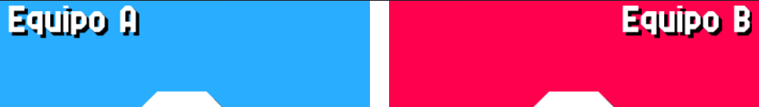
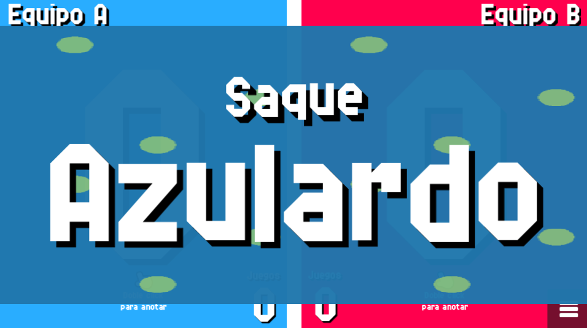

# Team Select

In this screen you can select the teams that will appear
in the match.

{: style="display:block;margin-left:auto;margin-right:auto;width:60%;padding-top:10px;padding-bottom:10px;"}

Team names will be used to be displayed alongside the score.

{: style="display:block;margin-left:auto;margin-right:auto;width:60%;padding-top:10px;padding-bottom:10px;"}

Player names will be used to display who serves on the current game.

{: style="display:block;margin-left:auto;margin-right:auto;width:60%;padding-top:10px;padding-bottom:10px;"}

The rest of this menu is explained in more detail in the [Team Settings](../settings/teams.md) page.
