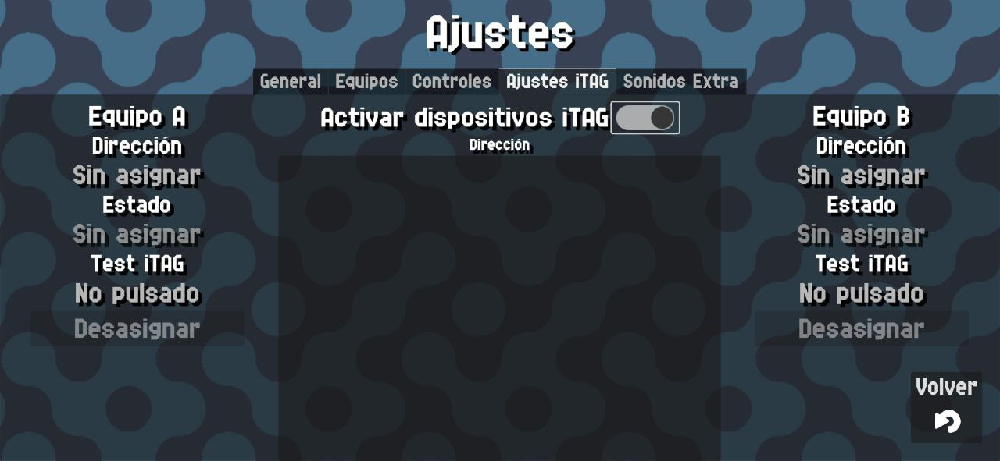

# Dispositivos ITAG

{: style="display:block;margin-left:auto;margin-right:auto;width:60%;padding-top:10px;padding-bottom:10px;"}

En esta pantalla puedes emparejar y gestionar Dispositivos ITAG.

Los dispositivos ITAG son dispositivos Bluetooth de bajo consumo que se usan principalmente para encontrar cosas cercanas que hayas perdido. Un ejemplo de un dispositivo así es este:

{: style="display:block;margin-left:auto;margin-right:auto;width:30%;padding-top:10px;padding-bottom:10px;"}

Cualquier dispositivo con ITAG en su nombre y con un botón que sea un dispositivo Bluetooth de bajo consumo debería funcionar.

!!! warning
    No garantizo que absolutamente todos los dipositivos ITAG vayan a funcionar.

Lo importante es que son dispositivos que funcionan por bluetooth de bajo consumo y tienen un botón que usaremos para incrementar la puntuación de cada equipo.

!!! warning
    Después de mucho desarrollo y testeo llegué a la conclusión de que estos dipositivos **no son tan fiables como los controladores/mandos bluetooth habituales**.

    Tienden a desconectarse cuando se encuentran a 5/8 metros de distancia, lo cual es menos que el tamaño habitual de una pista de pádel, y pueden dar interferencias o problemas con altavoces bluetooth.

    Por este motivo, **desgraciadamente no recomiendo usarlos.** Funcionan pero a menudo dan problemas.

    Invertí demasiado tiempo en intentar debuggearlos y hacer que funcionaran bien. Si alguien que sepa más que yo del tema quiere ayudar, por favor que se ponga [en contacto conmigo](../help.md)

Para emparejar un dispositivo ITAG, una vez que hayas activado el bluetooth y la ubicación verás la lista de dispositivos ITAG disponibles.

!!! note
    Contador Pádel NUNCA usará tu ubicación para ningún fin. Android requiere este permiso para utilizar dispositivos bluetooth de bajo consumo.

Deberás emparejar un dispositivo por cada equipo haciendo clic el botón `Asignar` y con eso la aplicación intentará conectarse a dicho dispositivo cada vez que detecte uno.

Después de emparejarlo, puedes usarlo directamente haciendo clic en su botón. Puedes usar el tester que hay en esta misma pantalla para probar los botones.
