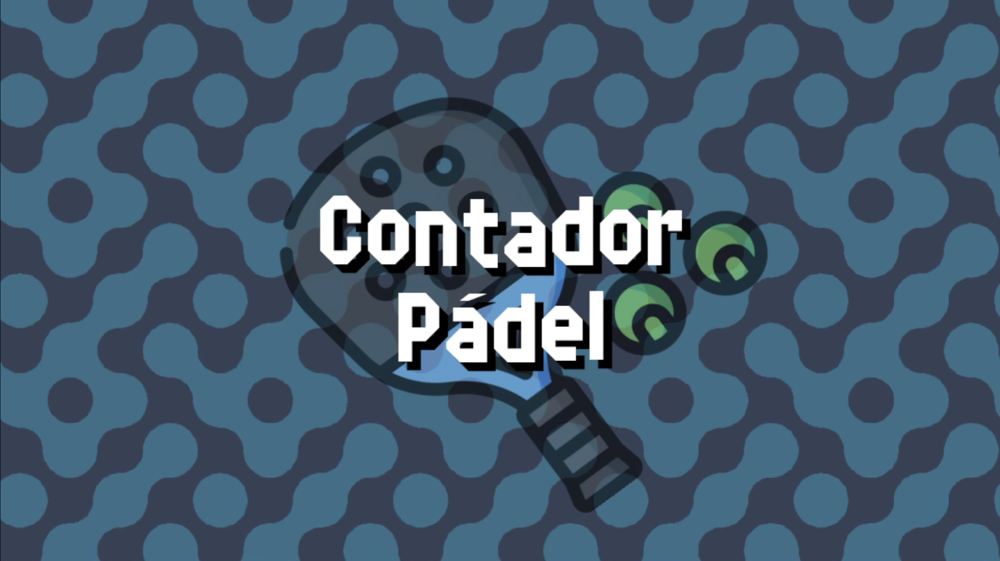

# ¡Bienvenido a la Documentación de Contador Pádel!

{: style="display:block;margin-left:auto;margin-right:auto;width:75%"}

¡Esta es la documentación de Contador Pádel, la aplicación que he hecho para llevar la cuenta de tus partidos de pádel!

Puedes **cambiar de idioma** en el selector de idioma (language) en **la barra de navegación superior**.

¡Haz click en uno de los siguientes enlaces para empezar!

- [Configuración Recomendada](./setup.md)
- [Guía de Inicio Rápido](./quickstart.md)
- [Opciones del Contador](./counter/counter.md)
- [Ajustes](./settings/index.md)
- [Ayuda/Informar de un problema](./help.md)

## Apoya el proyecto

Contador Pádel es una aplicación gratuita, pero si quieres apoyar el proyecto de alguna forma, puedes donar la cantidad que quieras en mi perfil de Ko-Fi.

[Clic aquí para ir a mi perfil de Ko-Fi.](https://ko-fi.com/rabidrabid)

## Créditos

- Icono ['Raqueta de Pádel'](https://www.flaticon.es/iconos-gratis/raqueta-de-padel) - hecho por [Freepik](https://www.freepik.com/) para [Flaticon](https://www.flaticon.es/)
- Fuente ['Delta Block'](https://ggbot.itch.io/delta-block-font) - hecha por [GGBotNet](https://www.ggbot.net/)
- Música ['Awake! (MegaWall-10)'](https://opengameart.org/content/awake-megawall-10) - hecha por [cynicmusic](https://cynicmusic.com)
- Efectos de sonido obtenidos de ['UI Audio'](https://kenney.nl/assets/ui-audio) - hechos por [Kenney](https://kenney.nl/)
- Iconos obtenidos de ['Game Icons'](https://kenney.nl/assets/game-icons) - hechos por [Kenney](https://kenney.nl/)
- Patrones de fondo obtenidos de ['Pattern Pack'](https://kenney.nl/assets/pattern-pack) - hechos por [Kenney](https://kenney.nl/)
- Texto a voz obtenido de [BeepBooply](https://beepbooply.com/)
- [Shader de fondo en movimiento](https://www.youtube.com/watch?v=cObwzagwgmA) - hecho por [Bacon and Games](https://www.youtube.com/@baconandgames)
- [Shader de llamas](https://www.youtube.com/watch?v=sCIr_58NN48) - hecho por [Heartbeast](https://www.youtube.com/@uheartbeast)
- Para los sonidos extra de ejemplo se usaron los siguientes sonidos:
    - [Video Game Cheerful Ending](https://opengameart.org/content/video-game-cheerful-ending)
    - [Fireworks With Applause Happy People](https://opengameart.org/content/fireworks-with-applause-happy-people)
    - [Pure Aluminum Warfare Bunker Day 28](https://opengameart.org/content/pure-aluminum-warfare-bunker-day-28)
    - [Stick to it Day 17](https://opengameart.org/content/stick-to-it-day-17)
    - [Kenney Music Jingles](https://kenney.nl/assets/music-jingles)
- Agradecimientos especiales al equipo y colaboradores de [Godot Engine](https://godotengine.org) por haber hecho el motor en el que se hizo esta app
