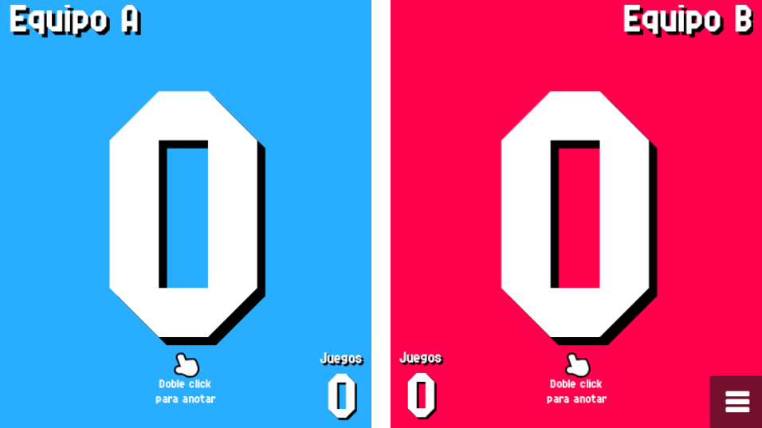

# Quick Start Guide

Using Padel Counter is easy! On the main screen you just hit the `Play` button to start
configuring the settings of the match.

{: style="display:block;margin-left:auto;margin-right:auto;width:60%;padding-top:10px;padding-bottom:10px;"}

If you want to customize your experience before starting a match, you can go to the
`Settings` section by clicking the `Settings` button. More details on the available Settings
[here](./settings/index.md).

After hitting the `Play` button you will be redirected to the `Match Settings`. In this screen
you can configure the rule set for the match you're about to play. You can check more details of
each setting in the [Match Settings](./counter/match.md) page.

{: style="display:block;margin-left:auto;margin-right:auto;width:60%;padding-top:10px;padding-bottom:10px;"}

Once you have your rule set configured, you will go to the `Team Select` screen, where you have
to choose the teams that will play in the match. By default there are 2 predefined teams in case
you don't want to spend time inputting the team data for both teams. More details about
adding/removing/editing teams in the [Team Select](./counter/teams.md) page.

{: style="display:block;margin-left:auto;margin-right:auto;width:60%;padding-top:10px;padding-bottom:10px;"}

Clicking the `Start` button will take you to the **Padel Counter**.

{: style="display:block;margin-left:auto;margin-right:auto;width:60%;padding-top:10px;padding-bottom:10px;"}

Once you're in here, you can double tap the side of the screen corresponding to each team to
increment their score. If you're using a remote controller and you remapped some keys/buttons
to the increment score actions of each team, by double clicking/pressing that input you'll also
increment the score.

If you make a mistake you can click the menu at the bottom right corner and click `UNDO` to undo your last scoring. More details on the options within this menu on the [Counter Details](./counter/counter.md) page.

The match will continue until one team wins. Alternatively you can exit the match by clicking
on the menu, scrolling left and clicking on the `Leave` button.

{: style="display:block;margin-left:auto;margin-right:auto;width:60%;padding-top:10px;padding-bottom:10px;"}

And that's it! You know the basics of controlling Padel Counter.

You can keep reading more about other options and details by navigating through the rest of
the pages in the sidebar.

You can start by checking the [Counter Configuration](./counter/index.md) page.
