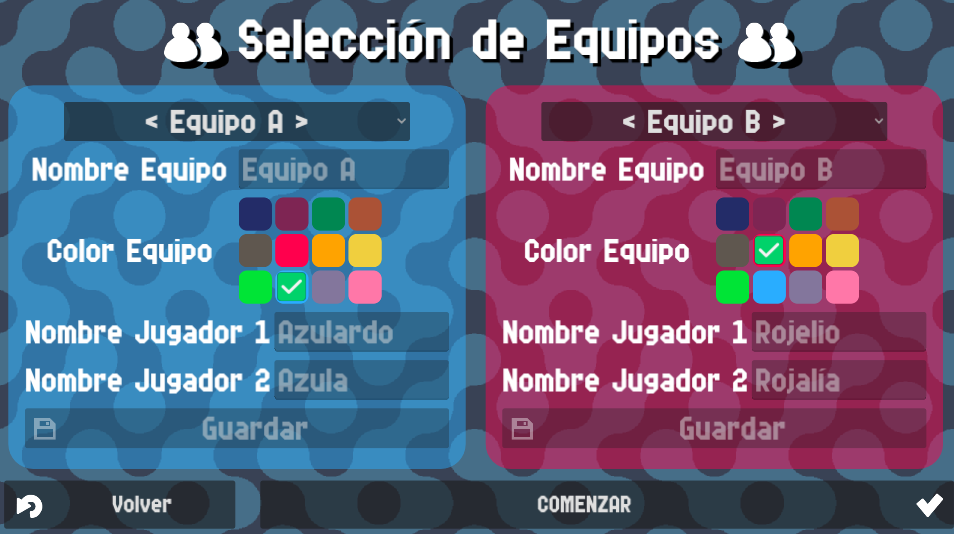

# Guía de Inicio Rápido

¡Es facilísimo usar Contador Pádel! En la pantalla principal solo tienes que pulsar el 
botón de `Jugar` para empezar a configurar los ajustes del partido.

{: style="display:block;margin-left:auto;margin-right:auto;width:60%;padding-top:10px;padding-bottom:10px;"}

Si quieres cambiar los ajustes antes de empezar un partido, puedes ir a la sección de `Ajustes` pulsando el botón de `Ajustes`. Tienes más detalles sobre los ajustes disponibles [aquí](./settings/index.md).

Después de darle al botón `Jugar` se te redirigirá a la pantalla de `Opciones de Partido`. En esta pantalla puedes configurar las reglas del partido que vas a jugar. Puedes consultar más detalles acerca de cada ajuste en la página de [Opciones de Partido](./counter/match.md).

{: style="display:block;margin-left:auto;margin-right:auto;width:60%;padding-top:10px;padding-bottom:10px;"}

Una vez definidas las reglas del partido, pasarás a la pantalla de `Selección de Equipos`, donde tendrás que elegir los equipos que jugarán el partido. Por defecto vienen 2 equipos predefinidos ya seleccionados en caso de que no quieras invertir tiempo en rellenar la información de los equipos para ambos equipos. Tienes más detalles sobre cómo añadir/quitar/editar equipos en la página de [Selección de Equipos](./counter/teams.md).

{: style="display:block;margin-left:auto;margin-right:auto;width:60%;padding-top:10px;padding-bottom:10px;"}

Haciendo clic en el botón de `Comenzar` irás directo al **Contador Pádel**.

{: style="display:block;margin-left:auto;margin-right:auto;width:60%;padding-top:10px;padding-bottom:10px;"}

Una vez aquí, puedes tocar dos veces la pantalla en el lado del equipo al que quieras incrementarle la puntuación. Si estás usando un mando/teclado remoto y has remapeado alguna tecla o botón para incrementar la puntuación, pulsando dos veces dicha entrada también aumentarás la puntuación.

Si te equivocas siempre puedes pulsar el botón de menú de la esquina inferior derecha y hacer clic en `DESHACER` para deshacer tu último incremento. Tienes más detalles sobre las opciones disponibles en este menú en la página de [Pantalla del Contador](./counter/counter.md).

El partido continuará hasta que uno de los equipos gane. Si no, siempre puedes salir del partido clicando en el menú de la esquina inferior derecha, haciendo un poco de scroll hacia la izquierda y haciendo clic en el botón `Dejar partido`.

{: style="display:block;margin-left:auto;margin-right:auto;width:60%;padding-top:10px;padding-bottom:10px;"}

¡Y ya estaría! Ahora ya sabes todo lo básico para controlar Contador Pádel.

Puedes seguir leyendo más acerca de otras opciones y detalles siguiendo los links al resto de páginas en la barra lateral.

Puedes empezar por echarle un ojo a la sección [Opciones del Contador](./counter/index.md).
