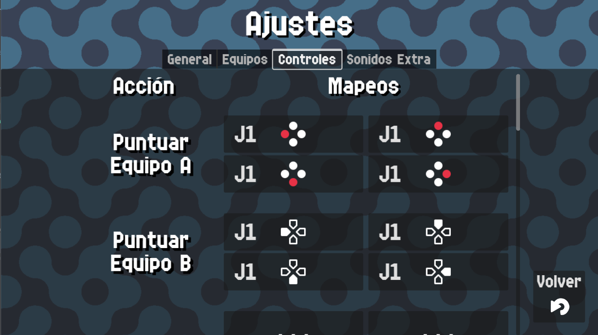

# Controls

{: style="display:block;margin-left:auto;margin-right:auto;width:60%;padding-top:10px;padding-bottom:10px;"}

In this screen you can remap actions to different input methods, for example a bluetooth gamepad/keyboard.

Simply press the button `Touch to assign` and then press some key/button to map it.

If you want to cancel the remapping, press the button again.

If you want to delete a remapping, map 2 times the mapping button and it will be restored.
