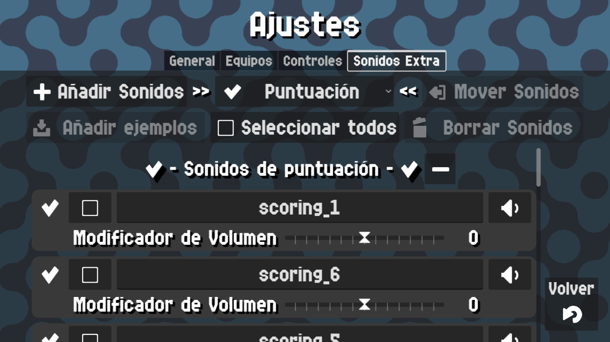
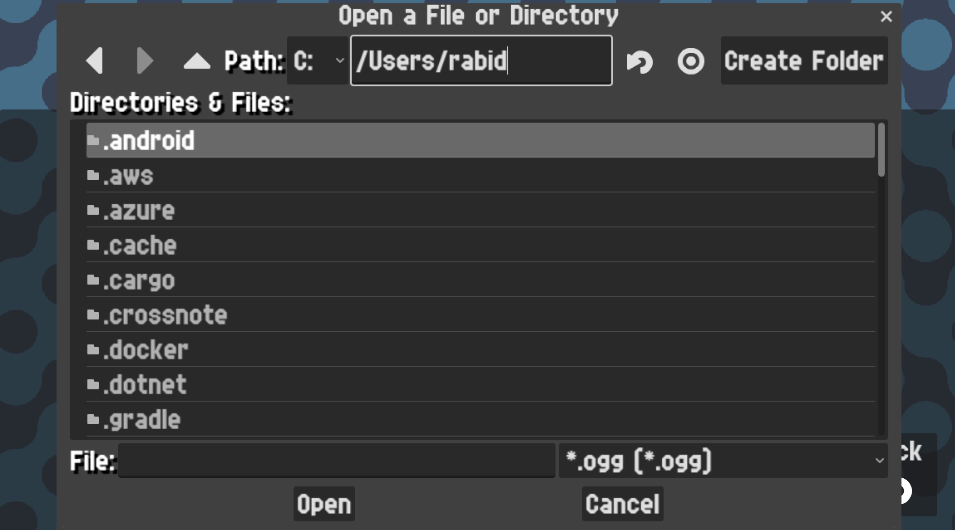

# Custom Sounds

{: style="display:block;margin-left:auto;margin-right:auto;width:60%;padding-top:10px;padding-bottom:10px;"}

In this screen you can add/edit/remove custom sounds that will be played during your padel matches.

Custom sounds are short sounds that will be played on different circumstances, adding a little bit of fun or spice to the match.

In order to use them, remember to enable the [Custom Sounds Setting](./general.md#enable-custom-sounds) at the [General Settings Tab](./general.md).

## Categories of custom sounds

As of today custom sounds can be played on these events.

- On scoring.
- On game won.
- On game won perfectly, this means winning by 40-0.
- On game won quickly, this means winning by 40-0 and under a certain amount of time.
- When scoring a comeback. A comeback happens when a team is winning by 40-0 then the losing team scores up to 40-40
  and it's 1 point away of winning the game.
- On game won by comeback. After a scoring comeback event, if the team that was losing initially finally wins, this event will happen.
- On set won.
- On match won.

## Adding custom sounds

To add custom sounds click the `Add sounds` button. If you didn't give permissions to the app, you will be requested to do so.

Here you can choose one of 2 things.

- A single `.ogg` file
- A folder containing multiple `.ogg` files

!!! note
    Currently the app only supports `.ogg` files, but I will try to improve this in the future.

{: style="display:block;margin-left:auto;margin-right:auto;width:60%;padding-top:10px;padding-bottom:10px;"}

These files will be added to the category that was currently selected on the dropdown menu.

!!! warning
    Please note that sounds must be less than **1 Megabyte** and **10 seconds.**

    Also the sounds for **scoring** will last only **2 seconds** and the rest will last **5 seconds**. The rest of the sound will be faded out.

    This is done to prevent very long sounds from taking too much time.

### Adding custom sounds faster

There's a faster way to add a lot of sounds with just one single folder: by creating a folder structure already categorized.

To do so, create a folder with the following structure (our folder will be called ``YourCustomSounds`` as an example)

```bash
/YourCustomSounds
├── comeback_game
├── comeback_scoring
├── quick_game
├── scoring
├── win_game
├── win_game_40_0
├── win_match
└── win_set
```

Copy this folder to your device. Then, inside the app, after clicking ``Add Sounds`` select the folder ``YourCustomSounds`` and the app will scan and add automatically all the sounds in each category.

## Editing Custom Sounds

You can edit your custom sounds by interacting with the list of custom sounds in this screen. For each sound you can edit its name,
increase or decrease its volume slightly and test it. When you make a change, a save button will appear so you can save your changes.

If you want to move the sound to another category, press the select button at the left of the custom sound panel, and click on the ``Move Sounds`` button above
(make sure you have selected the category you want to move the sounds to).

## Deleting Custom Sounds

If you want to delete one or multiple sounds, press the select button at the left of the custom sound panel for each sound you want to delete,
and click on the ``Delete Sounds`` button above. A confirmation popup will appear.

!!! note
    This will NOT delete the original files, just the reference that Padel Counter keeps internally.
