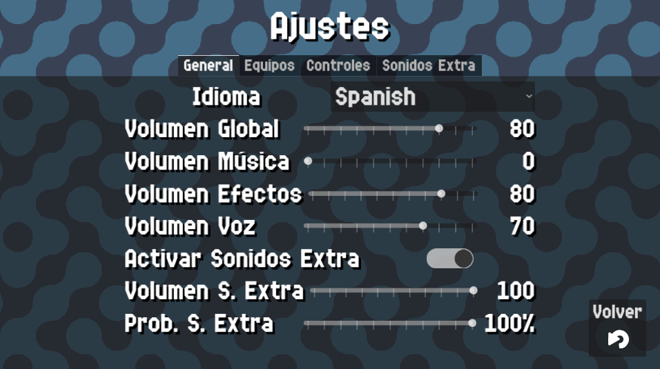

# General Settings

{: style="display:block;margin-left:auto;margin-right:auto;width:60%;padding-top:10px;padding-bottom:10px;"}

In this screen you can configure some general app settings.

## Language

Change the language of the app. Currently only english and spanish are supported.

!!! info
    Want your language to be supported? [Contact me!](../help.md)

## Global volume

Sets the global volume for the app. This includes all of the below volumes.

## Music volume

Sets the music volume. Currently only the main menu music will be affected.

## Voice volume

Sets the volume from the announcer. A voice line will play to test it.

## Enable Custom Sounds

Enables custom sounds. For more details in custom sounds, please check the [Custom Sounds page](./custom_sounds.md)

## Custom Sounds Volume

!!! info
    This setting will only show if [**Custom Sounds**](./general.md#enable-custom-sounds) are enabled
Sets the volume for custom sounds. A sound will play to test it.

## Custom Sounds Chance

!!! info
    This setting will only show if [**Custom Sounds**](./general.md#enable-custom-sounds) are enabled
Sets the probability of custom sounds playing whenever a custom sound should play. A chance of 100% means that a custom sound
will always play whenever conditions for a custom sound are met.
