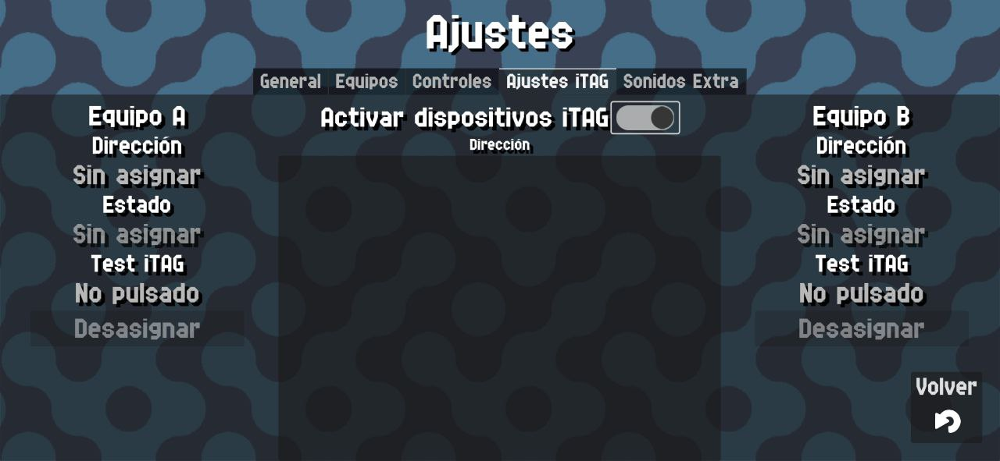
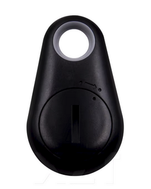

# ITAG Devices

{: style="display:block;margin-left:auto;margin-right:auto;width:60%;padding-top:10px;padding-bottom:10px;"}

In this screen you can pair and manage ITAG Devices.

ITAG devices are Bluetooth Low Energy devices mainly used for finding out things you might have lost nearby.
One example of such a device is this one:

{: style="display:block;margin-left:auto;margin-right:auto;width:30%;padding-top:10px;padding-bottom:10px;"}

Any device with ITAG on their name with a button that is a Bluetooth low energy device will work.

They're devices that function via bluetooth with low power consumption and they have a button which we will use to increase or decrease the score of each team.

!!! warning
    After a lot of developing and testing I came to the conclusion that **they are not as reliable as a traditional bluetooth controller**.

    They tend to disconnect when being farther than 5-8 meters, which is less than the typical court size, and can have problems with bluetooth speakers.

    For this reason, **unfortunately I do not recommend using them**. They work but they often give problems.

    I spent too much time trying to debug them, if someone wants to help making these more reliable please [contact me](../help.md)

To pair them, once you have enabled location and bluetooth on your device you will see the list of available ITAG devices.

You have to pair one for each team by clicking on the assign button and the app will automatically try to connect every time it detects one.

After being paired you can directly use them by clicking the buttons. You can use the tester in this same screen to test the buttons.
