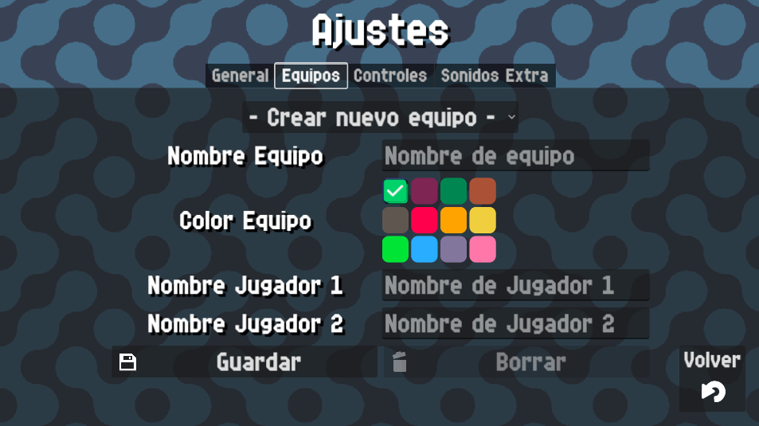

# Teams

{: style="display:block;margin-left:auto;margin-right:auto;width:60%;padding-top:10px;padding-bottom:10px;"}

In this screen you will be able to create, edit and delete teams to use in your padel matches.

### Create a team
To create a new team choose the option `Create new team` in the dropdown.

Then fill the form with `Team name`, `Player 1 Name`, `Player 2 Name` and `Team Color`.

!!! warning
    Team and player names are limited to only alphanumeric characters and 20 characters long.

Click on `Save` button to save the team.

### Edit a team

If you want to edit a team, simply select it on the dropdown and make the changes you want, then click on `Save`

### Delete a team

To delete a team, select it in the dropdown menu and press the `Delete` button and accept the confirmation popup that will appear.
