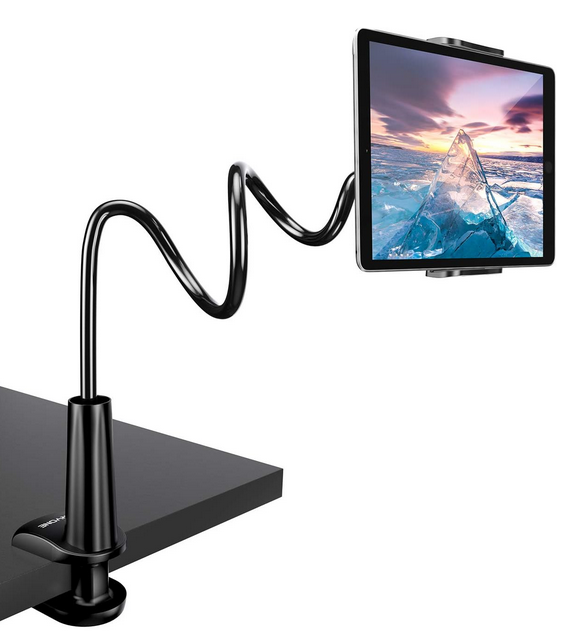
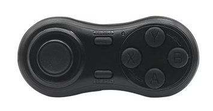
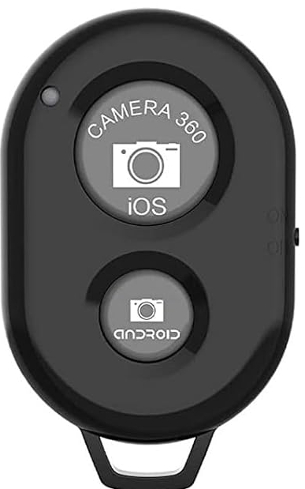

# Recommended Setup

## Summary
This app can be used on any Android device, and as such, you only need one to use it.

However, in order to be usable comfortably during the match, the best setup is the one that allows you to see the
score at a distance and also allows to be able to control it remotely, so you don't need to approach the screen to
increment the score.

Because of this, I recommend getting the following gear.

## Recommended gear

1. A **tablet** for bigger screen, so you can see it from a distance. A cheap one will do.
2. A **tablet grip**, so you can attach it to the fence somehow.
  {: style="display:block;margin-left:auto;margin-right:auto;width:25%;padding-top:10px;padding-bottom:10px;"}
3. **Bluetooth speakers**, so you can hear the announcer.
4. A small remote **bluetooth controller**. The remote bluetooth controller must have some kind of keyboard or gamepad input.
  This is just an example, anything will do, but the smaller the better so it fits your pocket.
  {: style="display:block;margin-left:auto;margin-right:auto;width:25%;padding-top:10px;padding-bottom:10px;"}
  There are some of them that are used to take pictures remotely, **it is not guaranteed that these will work** because typically the input sent is the same
  as if you pressed volume up or volume down on your device, and that can't be used as input. (Example of a non-working device below)
  {: style="display:block;margin-left:auto;margin-right:auto;width:20%;padding-top:10px;padding-bottom:10px;"}
  To be 100% sure, make sure that the input sent by these devices is either a keyboard input or gamepad input. Otherwise it might not work

## Setup

Download the app on the tablet.

Set up the tablet (with the tablet grip) and pair the bluetooth controller to it.

Inside the app, on the settings menu -> controls tab, map the `Increment Score A` and `Increment Score B` actions to any button on the remote gamepad.
(More details on how the remapping works on the [Controls](./settings/controls.md) page)

And that's it! Now you can start playing and count your score without having to approach the device.

{: style="display:block;margin-left:auto;margin-right:auto;width:25%;padding-top:10px;padding-bottom:10px;"}

Follow the [Quick Start Guide](./quickstart.md) for next steps!
